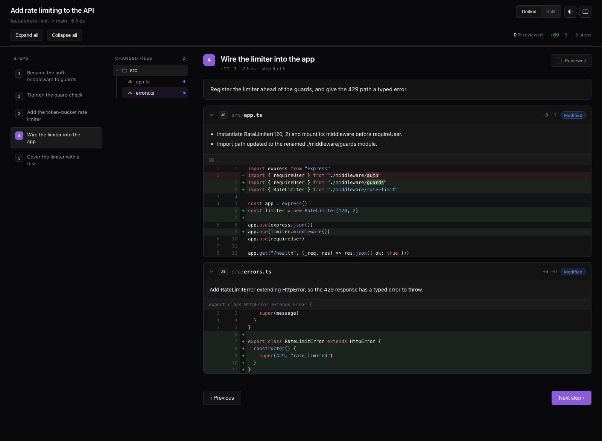
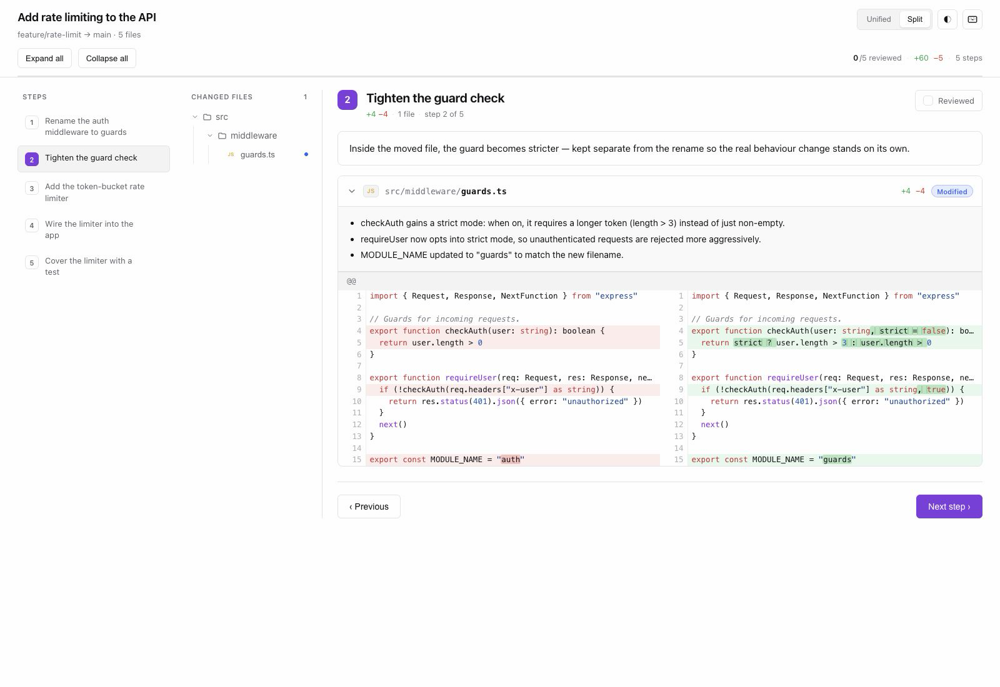
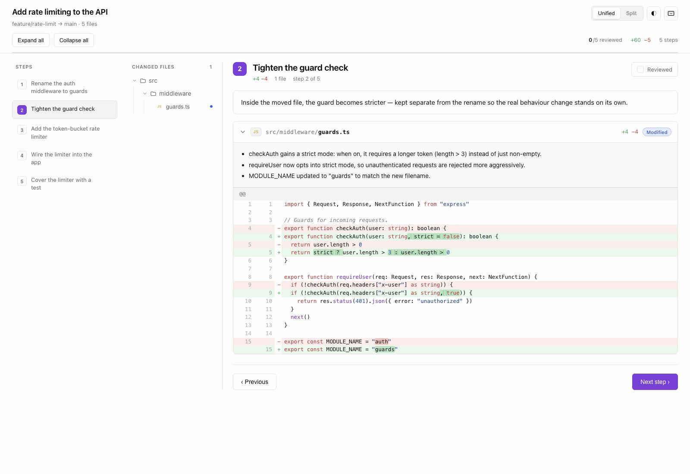

# pr-storyboard

[](https://skills.sh/krmznkr/skills)

**Turn any diff into a narrated, step-by-step storyboard you read in the
browser.** Point your agent at a pull request, a diff, your branch against
`main`, or your uncommitted changes — it groups the files into an ordered
sequence of steps ("first the rename, then the new module, then the wiring, then
the tests"), explains *why* each one changed, and paints it all as a single,
self-contained HTML page.



This is one [agent skill](#what-is-a-skill). The intelligence — reading the
diff, finding the story, grouping the steps — lives in the agent; a small,
dependency-free renderer turns the agent's plan into the UI. It's designed to be
**small, hackable, and model-agnostic** — works with any coding agent, no build
step, no server, no npm dependencies.

**Jump to:** [Quickstart](#quickstart-30-second-setup) ·
[Why it exists](#why-it-exists) · [What it does](#what-it-does) ·
[How it works](#how-it-works--the-agent-is-the-reviewer) ·
[Install](#install) · [Invoke](#invoke) ·
[Keyboard shortcuts](#keyboard-shortcuts) ·
[Documentation](docs/README.md)

## Quickstart (30-second setup)

1. **Install** it into your project (or add `-g` for all projects):

   ```bash
   npx skills add krmznkr/skills
   ```

   When prompted, select **`pr-storyboard`** and the agents you use. This works
   via [skills.sh](https://skills.sh/krmznkr/skills) with Claude Code, Cursor,
   Codex, Copilot, OpenCode, Zed, and 70+ others. (On OpenCode, restart after
   installing.)

2. **Ask your agent**, in plain language:

   > "Walk me through this PR, step by step." *(paste a URL, or point at your
   > branch)*

3. **Read the storyboard** — it opens in your browser as an ordered walkthrough
   with commentary. That's it.

Full install options (global, per-agent, updating, from source) are in
[Install](#install).

---

## Why it exists

Reviewing a change by scrolling a **flat diff** is backwards. A diff is a pile
of hunks in file order — it doesn't tell you *what the author did* or *in what
order to understand it*. The signal is buried in the noise.

Two things make it worse:

- **No narrative.** Twelve changed files, and nothing tells you the rename came
  first, the new module second, the wiring third. You reconstruct the story in
  your head, every time.
- **Renames masquerade as rewrites.** A file that was **moved *and* edited**
  shows up as one noisy block (or, over the GitHub API, as a full delete + add).
  You waste attention separating "this just moved" from "this actually changed".

**The fix:** let the agent do what a thoughtful author does in a good PR
description — read the whole change, find the story, and walk you through it in
order, with a sentence of *why* per step. Then render that as something you'd
actually enjoy reading. Renames get pulled apart from their edits automatically
(see [below](#destructuring-a-diff--the-hard-part-handled)).

## What it does

- **It tells a story.** Not a flat file list — an ordered walkthrough with
  commentary, the way a thoughtful author would talk you through their PR.
- **It destructures messy diffs.** A file that was *renamed **and** edited* is
  split: the move reads as a clean "File moved" step, the edits as their own
  step. No more untangling both at once. (More below.)
- **The UI is genuinely nice.** shadcn-styled, light/dark, unified **or** split,
  a per-step repository tree, word-level + syntax highlighting, keyboard-first,
  review-progress tracking.
- **Changed files stay easy to find.** Each step includes a folder tree rooted
  at the project. Click a file to open, scroll to, and highlight its exact diff.
- **One portable file.** No build, no server, no `npm install`. Opens from
  `file://`. Keep it, or send it to a teammate.

## How it works — the agent is the reviewer

The intelligence lives in the agent, not a script. A diff parser can't know that
three files are really one idea, or why a function moved. So the agent runs a
reviewer's process:

1. **Get the diff** — branch vs base (`git diff -M main...HEAD`), local or staged
   changes, or a GitHub PR (`gh pr diff`). It passes `-M` so moves are detected
   as renames, not delete + add.
2. **Read it whole and find the story** — structural moves first, then new
   building blocks, then wiring, then supporting changes, then tests.
3. **Group into steps** — related files together, each step one coherent idea;
   split a renamed-and-edited file so the move and the edits land in different
   steps.
4. **Write a `plan.json`** — the ordered steps, each with a title and commentary.
5. **Render** to HTML with `scripts/render.mjs` — a dependency-free renderer that
   parses the diff, computes word-level highlights, and paints the UI.
6. **Look and refine** — the agent opens the result and tightens the grouping and
   the commentary until the change reads clearly.

The renderer is the brush; the story is the art.

## See it

**Split view**, side by side — remembered between visits:



**Light theme** — follows your OS by default, with a toggle:



## Destructuring a diff — the hard part, handled

Real changes are messy. The classic mess: a file gets **renamed and edited in
the same commit**. A flat diff crams both into one noisy block. pr-storyboard
pulls them apart — the same file shows up as a clean move in one step and as its
actual edits in another:

| Step 1 — the move | Step 2 — the edits |
| --- | --- |
| `auth.ts → guards.ts`, shown as *File moved*, `+0 −0` | `guards.ts` edits only, word-level highlights, *Modified* |

The agent drives this by targeting *part* of a file in its plan
(`part: "rename"` / `part: "content"`, or specific `hunks` / `lines`). Anything
it doesn't explicitly place collects into a trailing "Everything else" step, so
nothing is ever dropped.

## Install

Two ways, two philosophies: the **skills CLI** installs a copy into your project
(or globally) so you can hack on it, while a **from-source symlink** tracks this
repo so a `git pull` keeps you current. Pick whichever fits.

**Requirements:** Node ≥ 16 for the CLI and the renderer. Optionally `git` and
the GitHub CLI (`gh`) so the agent can fetch PR/branch diffs. No npm
dependencies.

### With the skills CLI (recommended)

```bash
npx skills add krmznkr/skills          # install into the current project
npx skills add krmznkr/skills -g       # install globally (all your projects)
```

- **Project vs global** — the default is project-level (writes into the repo you
  run it in). Add `-g`/`--global` for a user-level install shared across
  projects.
- **Pick agents** — installs to every detected agent by default. Scope it with
  `-a`/`--agent`, e.g. `--agent claude-code cursor`, or `--agent '*'` for all.
- **Preview / non-interactive** — `-l`/`--list` shows the skills in the repo
  without installing; `-y`/`--yes` skips prompts; `--copy` copies files instead
  of symlinking.

Manage it later:

```bash
npx skills list                        # what's installed
npx skills update krmznkr/skills       # pull the latest version
npx skills remove pr-storyboard        # uninstall
```

> **OpenCode:** config and skills load at startup — quit and restart OpenCode
> after installing so it picks up the new skill.

### From source (to hack on it)

The skill lives at [`skills/pr-storyboard/`](skills/pr-storyboard/) and
works with any agent that loads Markdown skills.

```bash
git clone https://github.com/krmznkr/skills.git
cd skills
./scripts/link-skills.sh               # symlink into ~/.config/opencode/skill and ~/.claude/skills
./scripts/list-skills.sh               # confirm it's discovered
```

Symlinking means a `git pull` keeps your install current — re-run
`link-skills.sh` after adding or renaming a skill. Prefer copies? Drop the
folder straight in:

```bash
cp -r skills/pr-storyboard ~/.claude/skills/          # Claude Code
cp -r skills/pr-storyboard ~/.config/opencode/skill/  # OpenCode
```

## Invoke

Just ask, in plain language. The skill is model-invoked — your agent reaches for
it when your request matches, or you can name it directly:

- *"Walk me through this PR."* (paste a URL or number)
- *"Explain the changes on my branch vs main, step by step."*
- *"Turn my staged changes into a storyboard."*
- *"Review github.com/org/repo/pull/1234 as a storyboard, about 8 steps."*
- *"Use pr-storyboard on the current diff."*

You can suggest a **step count** (5 / 10 / 15) — the agent treats it as a hint
and picks whatever makes the change readable. It generates the diff, writes a
plan, renders the HTML, and opens it in your browser.

### Run the renderer directly

You rarely need to, but the renderer is a normal CLI:

```bash
git diff -M main...HEAD > changes.diff
node skills/pr-storyboard/scripts/render.mjs \
  --plan plan.json --diff changes.diff --out storyboard.html --open
```

See [`skills/pr-storyboard/REFERENCE.md`](skills/pr-storyboard/REFERENCE.md)
for every flag and the full `plan.json` schema.

The repository-wide documentation explains the agent/renderer boundary,
coverage model, artifact runtime, installation paths, trust boundary, and
known quality gaps:

- [`docs/README.md`](docs/README.md) — documentation map.
- [`docs/architecture.md`](docs/architecture.md) — complete architecture.
- [`docs/roadmap.md`](docs/roadmap.md) — missing safeguards and release work.

## Keyboard shortcuts

Intuitive, not vim. Press `?` in the storyboard for the full list.

| Keys | Action |
| ---- | ------ |
| `↑` `↓` `←` `→` | Move between steps |
| `1`–`9`, `⌘/Ctrl+1`–`9` | Jump to step N |
| `Home` / `End` | First / last step |
| `Enter` / `R` | Toggle "reviewed" |
| `U` | Unified ⇄ Split |
| `E` / `C` | Expand / collapse all files |
| `T` | Toggle theme · `?` help · `Esc` close |

## What is a skill?

A skill is a self-contained folder with a `SKILL.md` that tells an agent **when**
to reach for it and **how** to do the work. Some ship supporting files
(references, templates, scripts) alongside. See
[`CONTRIBUTING.md`](CONTRIBUTING.md) for the authoring conventions.

## License

[MIT](LICENSE)
