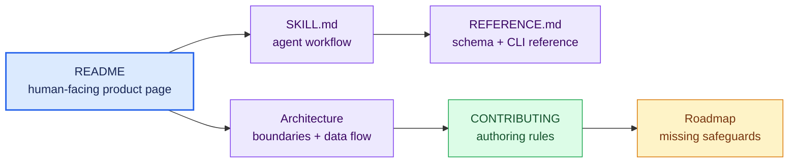

# Documentation index

This repository packages an agent-facing skill and a deterministic browser
renderer. Human-facing product documentation and agent instructions are kept
separate so each audience gets the right level of detail.

| Document | Audience and purpose |
| --- | --- |
| [`../README.md`](../README.md) | People evaluating, installing, or invoking the skill |
| [`../skills/pr-storyboard/SKILL.md`](../skills/pr-storyboard/SKILL.md) | Agents executing the required storyboard process |
| [`../skills/pr-storyboard/REFERENCE.md`](../skills/pr-storyboard/REFERENCE.md) | Maintainers and agents needing the complete plan schema and renderer CLI |
| [`architecture.md`](architecture.md) | Maintainers reasoning about boundaries, coverage, artifacts, trust, and failure behavior |
| [`../CONTRIBUTING.md`](../CONTRIBUTING.md) | Contributors changing the skill, renderer, fixtures, or screenshots |
| [`roadmap.md`](roadmap.md) | Maintainers tracking quality and release-system gaps |
| [`../SECURITY.md`](../SECURITY.md) | Private reporting for executable or prompt/data-boundary risks |
