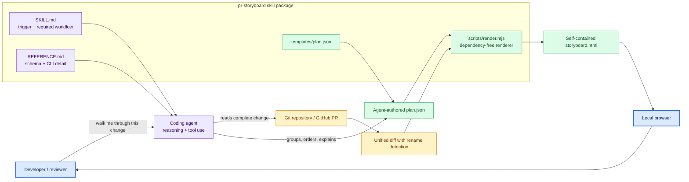
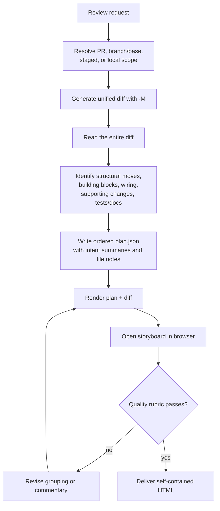
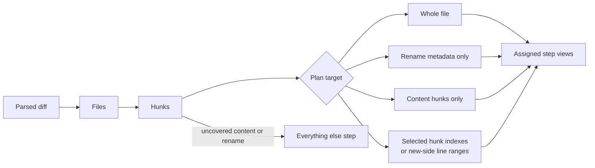
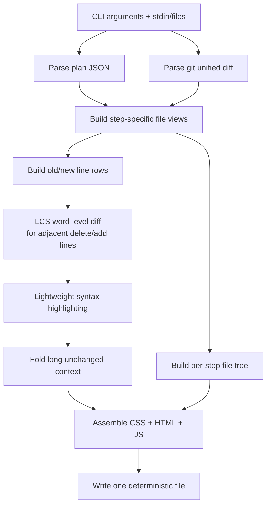
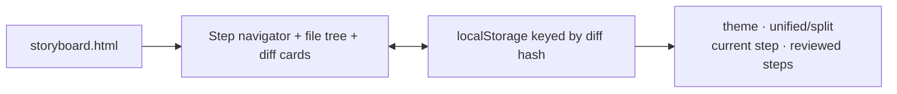
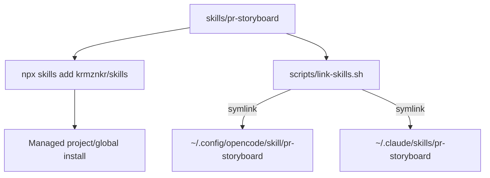

# Repository architecture

This repository ships agent skills as self-contained directories. It currently
contains one skill, `pr-storyboard`, whose job is to turn a flat Git diff into
an ordered review narrative and a portable HTML artifact.

The central design boundary is deliberate: the agent interprets the change;
the renderer only applies deterministic mechanics.

## System context

No service or model API is built into the repository. The active coding agent
supplies the intelligence using its existing tools and model; the renderer is a
local Node program.

## Skill package layers

| Layer | Audience | Responsibility |
| --- | --- | --- |
| `SKILL.md` | Agent | Match the right requests and enforce the end-to-end review process |
| `REFERENCE.md` | Agent, on demand | Exact plan schema, sub-file targeting, renderer flags, and UI behavior |
| `templates/` | Agent/author | Valid starting structures |
| `scripts/render.mjs` | Machine | Parse, slice, highlight, and render deterministically |
| `examples/` | Maintainer | Stable demo inputs for screenshots and manual verification |
| Root `README.md` | Human | Product explanation, installation, invocation, and screenshots |
| Root scripts | Maintainer | Discover and symlink all skills in this repository |

This is progressive disclosure: the small trigger/workflow file is always
legible, while exhaustive detail is loaded only for execution or maintenance.

## Storyboard workflow

The browser inspection loop is part of the skill contract. A syntactically
valid first render is not considered complete until the ordering, coverage,
notes, renames, and highlights have been checked visually.

## Change coverage model

A file may appear in multiple steps when it carries multiple ideas—for example,
a move in one step and behavioral edits in another. The renderer tracks
coverage at rename/hunk granularity and automatically exposes anything the plan
did not place. That makes omission visible rather than silently dropping
changes.

## Renderer pipeline

The renderer uses Node standard-library modules only. It does not fetch remote
assets and produces an HTML file containing its styles, scripts, parsed diff,
navigation, and state handling.

## Artifact runtime

The generated HTML opens directly from `file://`.

Review state is local to the browser profile and namespaced by a stable hash of
the diff. The artifact does not contact the repository, GitHub, the agent, or a
server after generation.

## Installation and discovery

`link-skills.sh` is idempotent for symlinks and refuses to replace a real
directory. `list-skills.sh` discovers `skills/*/SKILL.md` and prints each
frontmatter description. The folder name and frontmatter `name` must match.

## Trust and data boundary

| Data | Where it goes |
| --- | --- |
| Git diff / PR contents | Coding agent context, local diff file, generated HTML |
| Agent commentary and grouping | Local `plan.json`, generated HTML |
| Review progress/preferences | Browser local storage |
| GitHub credentials | Used by the caller's `gh`; never read by the renderer |
| Model credentials | Owned by the active agent/CLI; absent from this repository |

The HTML may contain all changed source lines and the agent's summaries. Treat
it with the same confidentiality as the underlying diff; do not share it more
broadly than the code it describes.

## Maintaining or adding a skill

```mermaid
flowchart LR
  change["Behavior change"]
  agentDocs["Update SKILL.md<br/>and REFERENCE.md"]
  mechanism["Update templates/scripts/examples"]
  humanDocs["Sync README"]
  screenshots["Regenerate screenshots<br/>when UI changes"]
  discover["Run list-skills.sh"]
  links["Run link-skills.sh"]
  review["Verify trigger, process,<br/>render, and docs agree"]

  change --> agentDocs --> mechanism --> humanDocs --> screenshots --> discover --> links --> review
```

For a new skill, add `skills/<name>/SKILL.md` with valid frontmatter, keep the
agent-facing entry point concise, and place exhaustive instructions one hop
away. Root discovery/link scripts require no per-skill registration.

## Failure behavior

| Failure | Result / recovery |
| --- | --- |
| Diff generated without useful rename detection | Re-run with `-M` or a lower similarity threshold |
| File/path in plan does not match diff | Grey “not in diff” placeholder; fix the plan |
| Plan omits a hunk or rename | Visible `Everything else` step |
| File with edits has no note | Visible warning in its card |
| Invalid plan JSON | Renderer exits; validate/fix JSON |
| No plan supplied | One flat “All changes” step, useful only as a fallback |
| Browser open command unavailable | HTML is still written and can be opened manually |
| Existing non-symlink install path | Link script skips it instead of overwriting |

## Sources of truth

- [`../skills/pr-storyboard/SKILL.md`](../skills/pr-storyboard/SKILL.md) —
  required agent workflow.
- [`../skills/pr-storyboard/REFERENCE.md`](../skills/pr-storyboard/REFERENCE.md)
  — plan and CLI contract.
- [`../skills/pr-storyboard/scripts/render.mjs`](../skills/pr-storyboard/scripts/render.mjs)
  — renderer behavior.
- [`../CLAUDE.md`](../CLAUDE.md) — repository conventions (`AGENTS.md` points
  to the same file).
- [`../CONTRIBUTING.md`](../CONTRIBUTING.md) — authoring principles and change
  checklist.
