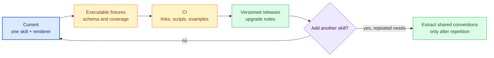

# Roadmap and known gaps

The repository currently ships one skill and a dependency-free renderer. Its
next improvements should increase determinism and maintainability without
turning the skill into a large framework.

| Priority | Gap | Suggested outcome |
| --- | --- | --- |
| Next | Examples are not an automated contract | Render the checked-in example, validate every plan reference, and assert deterministic output structure |
| Next | No repository CI | Check shell syntax, list/link scripts, internal Markdown links, skill frontmatter, renderer fixtures, and generated example consistency |
| Next | No formal schema validation | Validate `plan.json` before rendering and return precise path/line-range errors |
| Later | No versioned release or upgrade policy | Tag meaningful skill/renderer changes and document compatibility expectations |
| Later | Single-skill layout may eventually repeat conventions | Extract shared tooling only after a second skill demonstrates a real common pattern |

Security-sensitive areas—untrusted diff text, generated HTML, file paths, and
prompt instructions—must continue to follow [`../SECURITY.md`](../SECURITY.md).
The architectural boundaries and failure behavior are in
[`architecture.md`](architecture.md).
